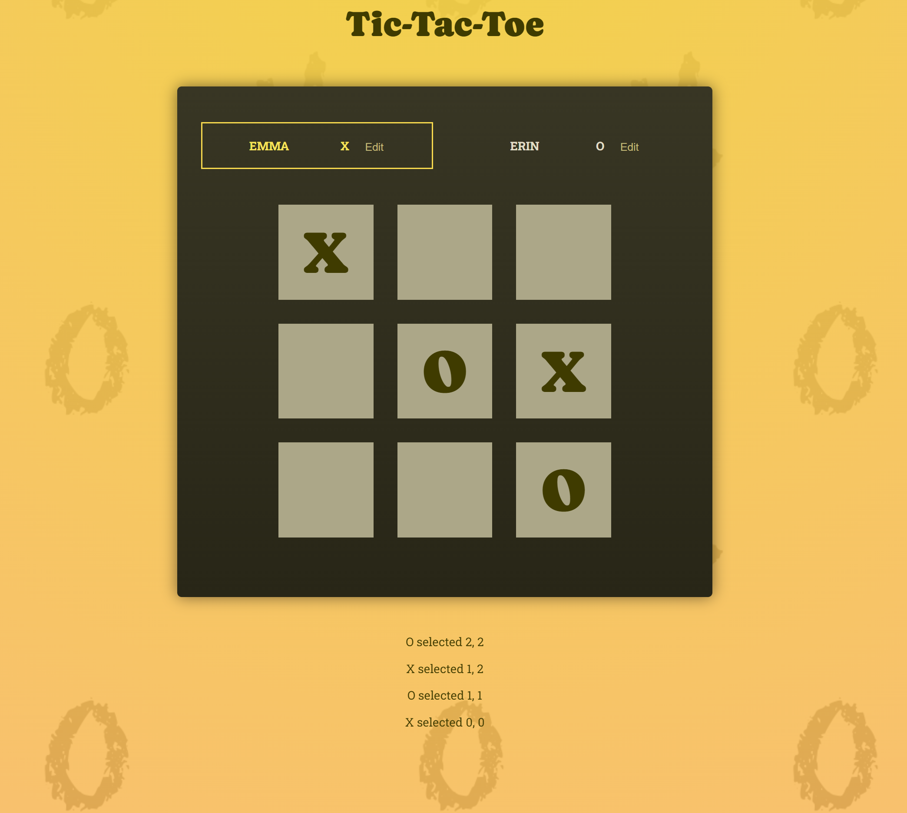
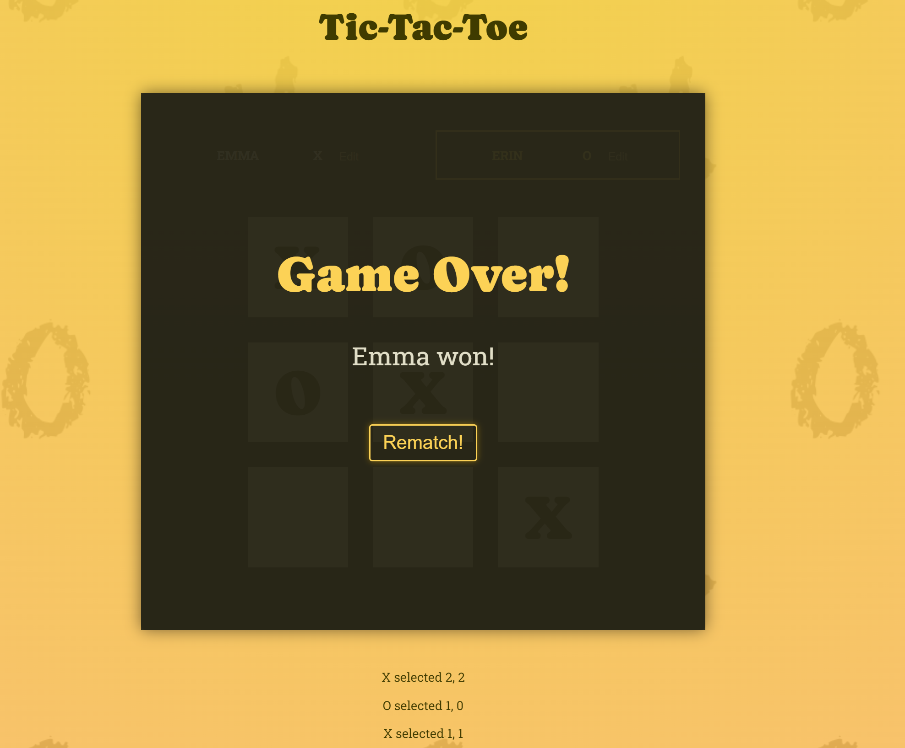

# Tic-Tac-Toe Game

Simple Tic-Tac-Toe game to play with your friends and family.

Play Tic-Tac-Toe here:
[Let's Play](https://tic-tac-toe-react-game.web.app/)

### Here's a picture of the game play:



### Here's a picture of the game over screen:



### Compiles and hot-reloads for development

```
npm run dev
```

## Built With

- [React](https://https://react.dev/)

## Deployed Using

- [Google Firebase](https://firebase.google.com/)

## Contributing

Pull requests are welcome. For major changes, please open an issue first to discuss what you would like to change.

## License

[MIT](https://choosealicense.com/licenses/mit/)

## Author

Garrett Chun - [![Github][1.1]][1] [![Twitter][1.2]][2]

[1.1]: ./src/assets/githubCat.png
[1.2]: ./src/assets/twitter20.png
[1]: https://github.com/KapakahiCoder
[2]: http://www.twitter.com/KapakahiCoder
